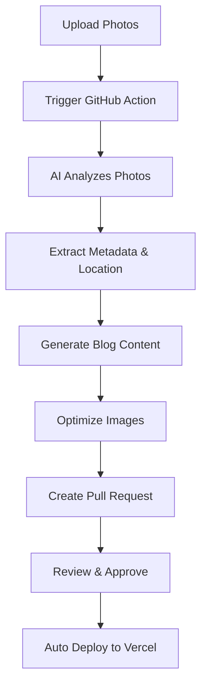

# 🚀 Korean Travel Blog - Deployment & Automation Guide

## 🎯 Quick Setup

### 1. Initial Setup
```bash
# Install dependencies
npm install
pip install -r requirements.txt

# Setup configuration
npm run blog setup
```

### 2. GitHub Repository Setup
```bash
# Initialize git repository
git init
git add .
git commit -m "Initial Korean travel blog setup"

# Create GitHub repository and push
git remote add origin https://github.com/yourusername/korean-travel-blog.git
git push -u origin main
```

### 3. Vercel Deployment Setup

1. **Connect to Vercel:**
   - Go to [vercel.com](https://vercel.com)
   - Import your GitHub repository
   - Deploy automatically

2. **Add Environment Variables in Vercel:**
   ```
   OPENAI_API_KEY=your_openai_key
   NEXT_PUBLIC_ADSENSE_ID=ca-pub-xxxxxxxxx
   ```

### 4. GitHub Secrets Setup

Add these secrets in GitHub repository settings:

```
OPENAI_API_KEY=your_openai_key
VERCEL_TOKEN=your_vercel_token
ORG_ID=your_vercel_org_id  
PROJECT_ID=your_vercel_project_id
GITHUB_TOKEN=automatically_provided
```

## 🤖 AI Blog Post Generation

### Method 1: GitHub Actions (Automated)

1. **Upload photos to repository:**
   ```bash
   mkdir photos/seoul-adventure
   # Add your photos to this directory
   git add photos/
   git commit -m "Add photos for Seoul adventure"
   git push
   ```

2. **Trigger automation:**
   - Go to GitHub repository → Actions
   - Run "Auto Generate Blog Post" workflow
   - Input:
     - Photos directory: `photos/seoul-adventure`
     - Location name: `Seoul Hidden Gems`
     - Post type: `travel-guide`

3. **Review and merge:**
   - AI creates a Pull Request with generated post
   - Review content and images
   - Merge to deploy automatically

### Method 2: Local Generation

```bash
# Interactive mode
npm run blog generate --interactive

# Command line mode
npm run blog generate --dir photos/busan-trip --name "Busan Coastal Adventure" --type travel-guide
```

### Method 3: CLI Tool

```bash
# List available commands
npm run blog --help

# Generate post interactively
npm run blog generate -i

# List existing posts
npm run blog list

# Preview blog locally
npm run blog preview
```

## 📁 Photo Directory Structure

```
photos/
├── seoul-adventure/
│   ├── IMG_001.jpg
│   ├── IMG_002.jpg
│   └── IMG_003.jpg
├── jeju-hiking/
│   ├── hallasan-1.jpg
│   ├── hallasan-2.jpg
│   └── crater-lake.jpg
└── busan-food/
    ├── food-market.jpg
    ├── seafood-1.jpg
    └── street-food.jpg
```

## 🔧 Configuration

### Environment Variables

Create `.env.local`:
```env
OPENAI_API_KEY=sk-...
NEXT_PUBLIC_ADSENSE_ID=ca-pub-xxxxxxxxx
```

### Google AdSense Setup

1. Apply for Google AdSense
2. Get publisher ID (ca-pub-xxxxxxxxx)
3. Update environment variables
4. Ads will appear after approval

## 🔄 Automation Workflow



## 📝 Post Generation Features

### AI Analysis:
- **Photo Content Recognition** - Identifies landmarks, food, activities
- **Location Detection** - Extracts GPS data and recognizes Korean locations  
- **Cultural Context** - Adds Korean cultural information and history
- **SEO Optimization** - Generates tags, keywords, and meta descriptions
- **Travel Tips** - Includes practical information and recommendations

### Image Processing:
- **Multiple Sizes** - Generates responsive image variants
- **Format Optimization** - Creates WebP and AVIF versions
- **Compression** - Optimizes file sizes for web performance
- **Metadata Extraction** - Uses EXIF data for context

## 🛠️ Advanced Usage

### Custom Post Templates

Edit `scripts/generate-post.py` to customize:
- Post structure and sections
- Writing style and tone
- Cultural information depth
- SEO optimization level

### Manual Editing

Generated posts can be manually edited in `posts/` directory:
```markdown
---
title: "Your Custom Title"
date: "2025-01-15"
excerpt: "Your custom excerpt"
coverImage: "/images/posts/location/cover.jpg"
tags: ["Korea", "Travel", "Custom"]
---

Your custom content here...
```

## 🚨 Troubleshooting

### Common Issues:

1. **OpenAI API Errors:**
   - Check API key validity
   - Ensure sufficient credits
   - Verify rate limits

2. **Image Processing Fails:**
   - Install Sharp: `npm install sharp`
   - Check image formats (JPG, PNG supported)
   - Verify file permissions

3. **GitHub Actions Fail:**
   - Check repository secrets
   - Verify Python dependencies
   - Check workflow permissions

### Debug Commands:

```bash
# Test AI generation locally
PHOTOS_DIR=photos/test LOCATION_NAME="Test" python scripts/generate-post.py

# Test image processing
node scripts/process-images.js photos/test

# Check blog CLI
npm run blog --help
```

## 📊 Performance Optimization

- Images are automatically optimized for web
- Multiple formats (JPG, WebP, AVIF) generated
- Responsive image variants created
- CDN delivery through Vercel
- Next.js automatic code splitting

## 🔒 Security Notes

- Never commit API keys to repository
- Use environment variables for secrets
- Review AI-generated content before publishing
- Verify image processing doesn't expose sensitive data

---

🇰🇷 **Ready to share your Korean adventures with the world!**